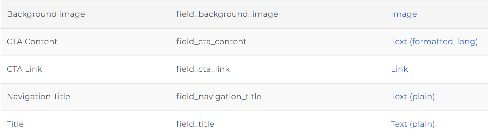

# Drupal 8 CTA Assembly Type Example

This demonstrates the process of creating a call to action (CTA) assembly type in Drupal 8. Here is an example of the CTA component:

and here is a table that describes the fields / data structure of the CTA assembly type:

## Steps to create a CTA assembly type

* [ Starting with a design and/or front-end component ](./steps/0-design-and-fe-component.md)
* [ Creating the CTA assembly type ](./steps/1-creating-the-cta-assembly-type.md)
* [ Adding assembly reference fields to entities ](./steps/2-adding-assembly-reference-fields.md)
* [ Creating and re-using assembly content ](./steps/3-creating-assembly-content.md)
