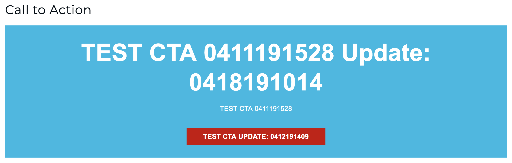

# Starting with a design and/or front-end component 

Here is an example mockup, the markup and styles required to create a CTA component.

### CTA Assembly Mockup Example



### CTA Assembly Markup (Twig)

```twig
{#
/**
 * @file assembly.html.twig
 * Default theme implementation to present Assembly data.
 *
 * This template is used when viewing Assembly pages.
 *
 *
 * Available variables:
 * - content: A list of content items. Use 'content' to print all content, or
 * - attributes: HTML attributes for the container element.
 *
 * @see template_preprocess_assembly()
 *
 * @ingroup themeable
 */
#}
<section{{ attributes.addClass('assembly') }}{{ audience_selection }}>
  <div class="container">
  
    {{- content -}}
  
  </div>
  
    <div class="background" style="background-image: url({{ background_image_url }});"></div>
  
</section>
```

### CTA Assembly styles

```scss
.assembly-type-call_to_action {
  background: $light-blue;
  color: #FFF;
  font-weight: bold;
  text-align: center;

  .text-formatted {
    color: #FFF;
    font-size: 18px;
    line-height: 1.5;
    @include tablet-portrait {
      font-size: 24px;
    }
  }

  .header {
    color: #FFF;
    font-size: 27px;
    line-height: 1.25;
    margin-bottom: 5px;
    @include tablet-portrait {
      font-size: 40px;
    }
    @include tablet-landscape {
      font-size: 57px;
      margin-bottom: 0;
    }
  }

  p, ul, ol {
    &:last-child {
      margin-bottom: 0;
    }
  }

  > .container > .button {
    &:last-child {
      margin-top: 24px;
      @include tablet-landscape {
        margin-top: 34px;
      }
    }
    &:first-child:last-child {
      margin-top: 0;
    }
  }

  &.left {
    float: none !important;
    text-align: left;
    .header {
      text-align: left;
    }
  }
  &.dark {
    background: #242424;
  }
}
```

[Next page](./1-creating-the-cta-assembly-type.md)
