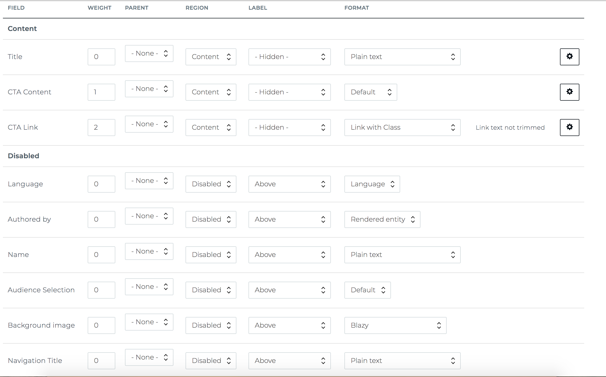

# Creating the CTA assembly type

1. Go to `/admin/structure/assembly/add` to add an assembly type
  * Add a label: `Call to Action`
  * Add a description: `A link with optional title, text, and background image`
  * We will add the following content into the Visual Styles input on this form:

```
left|Left|Left aligned content
dark|Dark|Dark background with white text
```

Visual styles are a way to provide a configurable set of styles that an editor/content author can use on an assembly to provide variations of a component (like a BEM modifier). These are the styles, which you can review in full on the [previous page](./0-design-and-fe-component.md), for the Left and Dark visual styles:

```scss
&.left {
  float: none !important;
  text-align: left;
  .header {
    text-align: left;
  }
}
&.dark {
  background: #242424;
}
```

After adding the label, description and visual styles, click the Save button to submit this assembly type add form.

2. After creating your assembly type, you can review the fields on your assembly type here: `/admin/structure/assembly/call_to_action/fields`. By default, no fields will exist on your new assembly type. Here is a screenshot of the fields we want to create on our CTA assembly type with their machine names and field types:


On this page, click on the Add Field button and create each of the fields in the screenshot above.

3. Now that we've added fields to our CTA assembly type, we have to configure the field formatter on the Manage Display tab here: `/admin/structure/assembly/call_to_action/display`. This is how we want to configure our display mode for the CTA assembly type:



[Previous Page](./0-design-and-fe-component.md)
[Next Page](2-adding-assembly-reference-fields.md)
