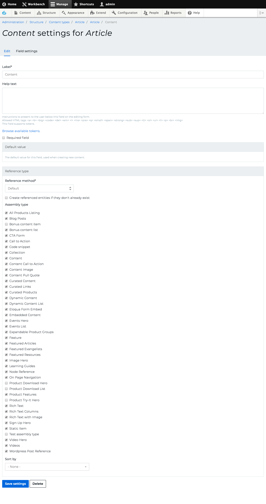

# Adding assembly reference fields

## Roles

* A Drupal sitebuilder: Programming not required. This involves a series of changes within the Drupal admin interface.

## Steps

To make this assembly type available from any of our content types (or fieldable entities generally), we will add an assembly reference (entity reference revisions) field to our entity. For this example, I will demonstrate adding a Content field to our Article content type.

1. Go here to view the fields on our Article content type: `/admin/structure/types/manage/article/fields`
2. Click the Add Field button to add a new field
3. In the Add new field dropdown, select 'Other...' under the Reference revisions label. Add a label and submit the form.
4. On this page, select Assembly in the Type of item to reference input. Select 'Unlimited' for the Allowed number of values input.
5. Click the 'Save field settings' button.
6. On this page (Content settings for Article), you will need to scroll down to the Reference type section and check all of the assembly type(s) you want to make reference-able from this Content field. In this example, we want to make sure the Call to action assembly type is checked. It should look something like this screenshot:

## Deliverables

* Our CTA assembly type can be referenced from the Content field of our Article content type

[Previous page](./2-creating-the-cta-assembly-type.md)
[Next page](./4-export-config.md)
