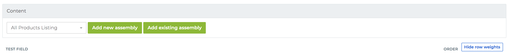
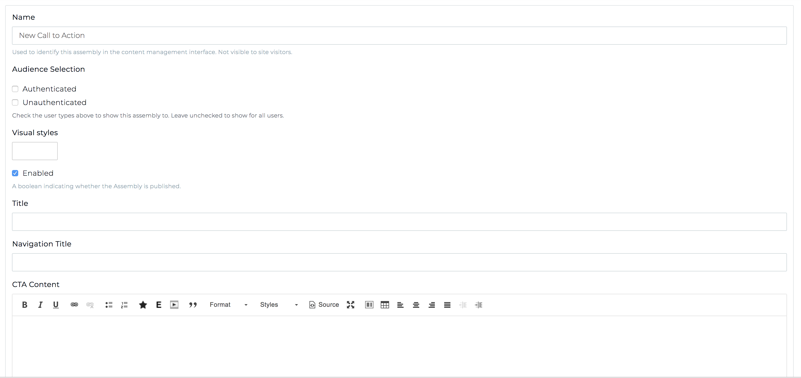
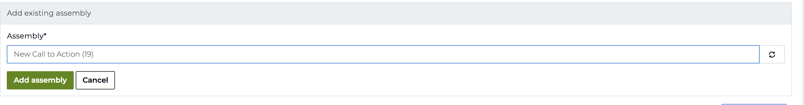
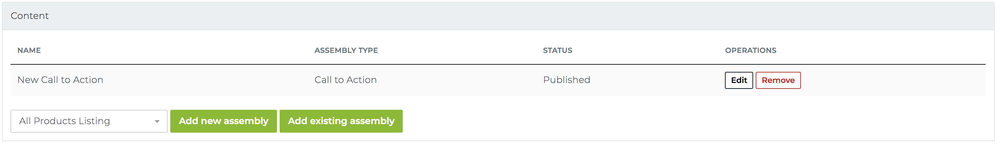

# Creating Assembly content

To demonstrate adding a CTA assembly to an Article, lets add a new Article: `/node/add/article`. You'll see our Content assembly reference field:

We can add a new CTA assembly:

This is what the inline entity form (IEF) looks like that will allow us to create this assembly within the Article node add form:

Creating a CTA assembly here, in this Article node add form, creates an Assembly entity that can be re-used on any other assembly reference field (which could be on any content type).

Here is a demonstration of how we could add an existing CTA assembly to our Content field on this new Article node:

This is what the Content field will look like after we've added a CTA assembly to our Content field:

[Previous page](./2-adding-assembly-reference-fields.md)
