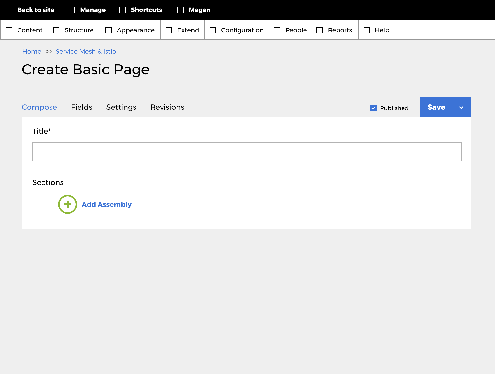
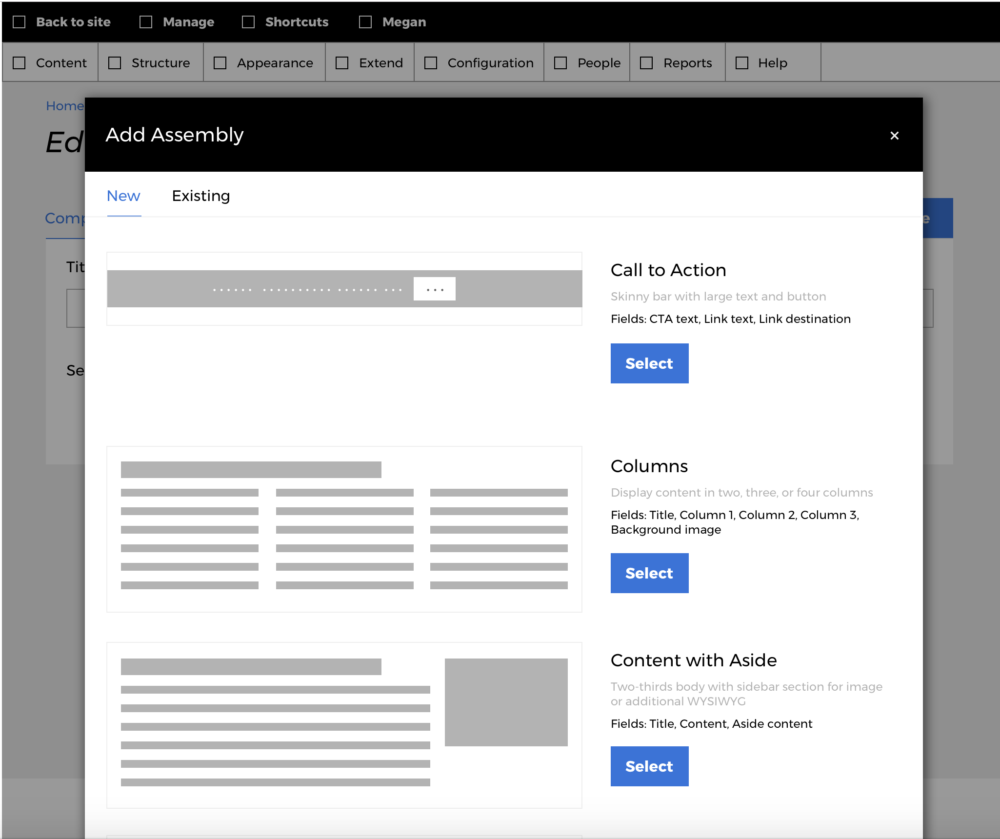
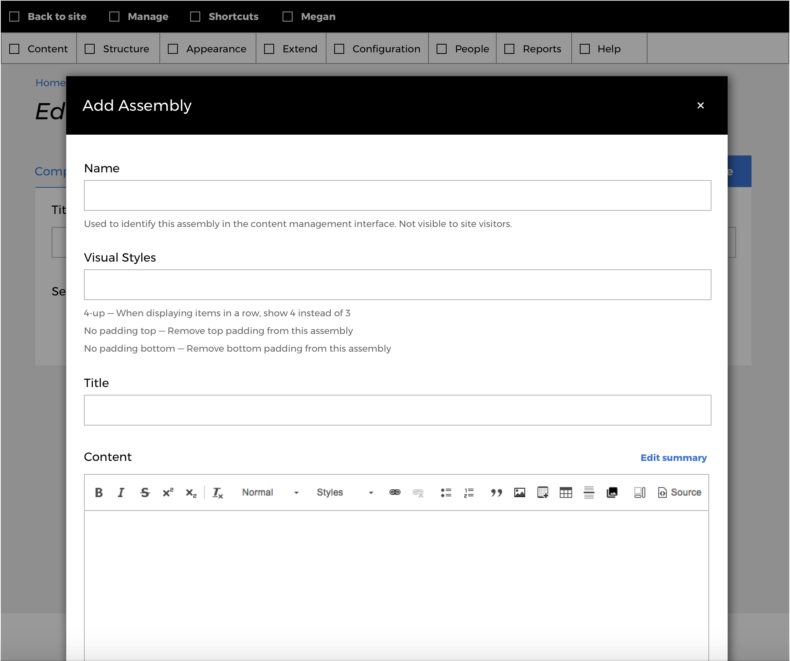
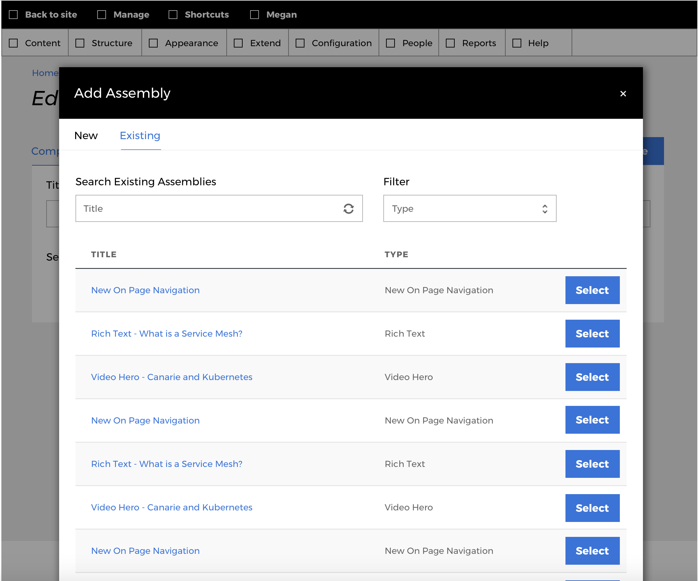
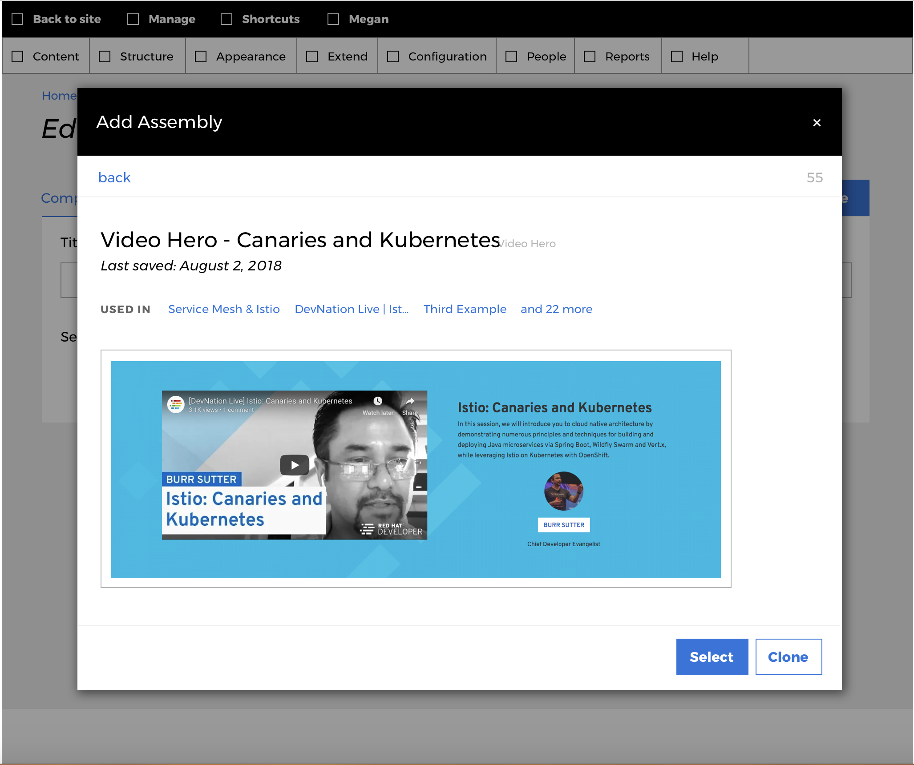

# Editor: Creating Assembly content

## Roles

* Editor

## Steps

To demonstrate adding an assembly to an Article, lets add a new Article: `/node/add/article`. You'll see our Content assembly reference field:

We can add a new assembly:

This is what the inline entity form (IEF) looks like that will allow us to create this assembly within this modal in the Article node add form:

Creating an assembly here, in this Article node add form, creates an Assembly entity that can be re-used on any other assembly reference field (which could be on any content type).

Here is a demonstration of how we could add an existing assembly to our Content field on this new Article node:

You will have the opportunity to preview the existing assembly in the modal:

This is what the Content field will look like after we've added an assembly to our Content field:

## Deliverables

* We've created an assembly on some Article node on our Drupal site

[Previous page](./4-export-config.md)
